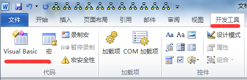
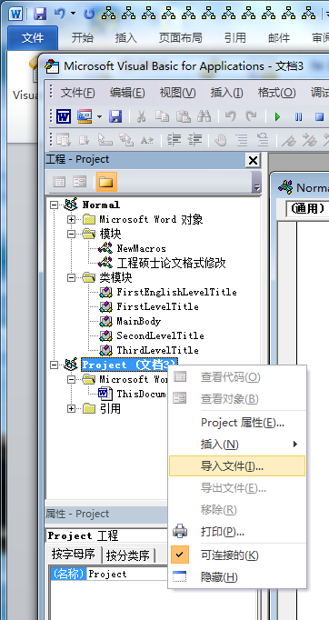
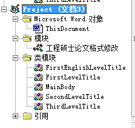
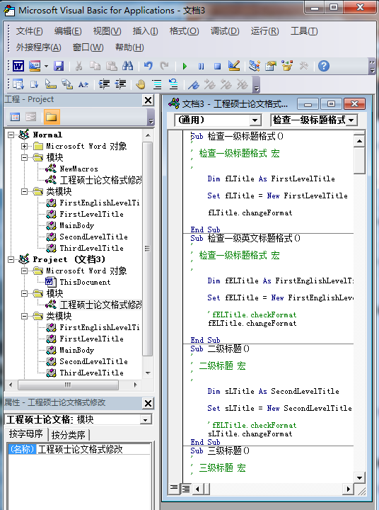
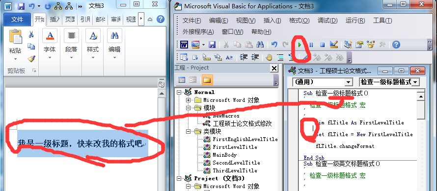
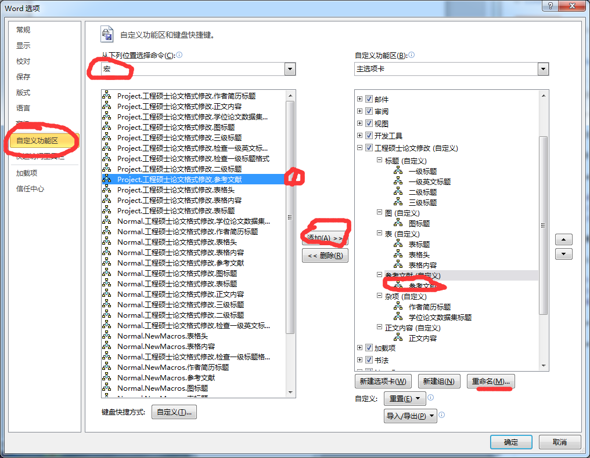
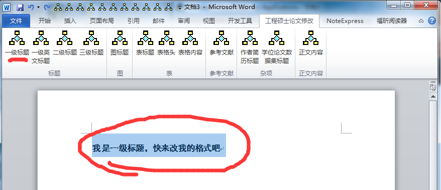

# MOEPaperLayout

这几天改论文排版，发现用vba用起来还挺快的。代码使用word2010中的vba编写。

## 使用说明

### 注意事项

1. 选中标题、参考文献的时候，要选中整个段落之后再执行
2. 修改正文内容的时候，不包含字体大小的修改，因为正文中的上下标以及引用标注会乱掉
3. 表格内容修改的时候，要选择整个表格。表格头修改的时候，只要选中表格头那一行

### 导入vba代码

1. 打开vba编辑器 
2. 点击导入文件按钮 
3. 依次导入所有*cls、*.bas文件 

### 直接使用

会vb编程的人可以直接在vba编辑器执行代码。

1. 双击打开“模块”中的“工程硕士论文格式修改”，会看到相应的代码，可以看到，有很多sub子过程。 
2. 选中论文中格式不正确的内容。
3. 在vba编辑器中执行相应的sub子过程。这一步鼠标要先点击相应的sub子过程，然后点击执行按钮或按F5。 

### 通过word选项卡使用

1. 新建word选项卡  效果如图： 
2. 选中论文中格式不正确的内容。
3. 点击选项卡中相应的按钮即可 
